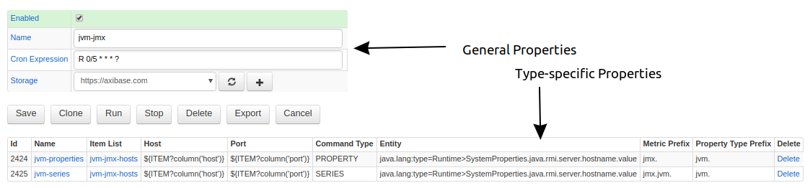

# Jobs

The Job is the primary unit of configuration and scheduling in Axibase Collector.

Each job has the following generic properties:

| **Name** | **Description** |
|:--- |:---|
| Type | Job type, such as JDBC, JMX, FILE, etc.|
| Name | Job name. |
| Enabled | Job schedule status. The job must be enabled to execute on schedule. |
| `cron` Expression | [`cron` Expression](./scheduling.md#cron-expressions) determines how frequently the job is executed by Collector.
| Storage | Target ATSD server for sending collected data. |

Type-specific properties, such as a SQL query in a JDBC job or a CSV parser in a FILE job, are specified in nested configuration objects.

```sh
+ job-1
  - configuration-1
+ job-2
  - configuration-2
  - configuration-3
...
```

The job can include multiple configurations. For example, a JDBC job can be configured to execute multiple SQL queries.



## Cloning Jobs

Create a copy of any job by clicking **Clone**.

The cloned job has the same name as the original job with the `-cloned` suffix appended.

By default, cloned jobs are disabled.

Enable an inactive job by selecting the **Enable** checkbox.

A cloned job has a unique primary key and can run concurrently with the original job.
