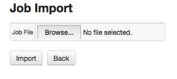
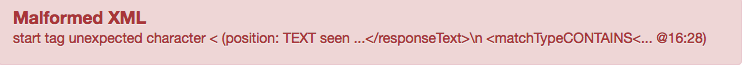
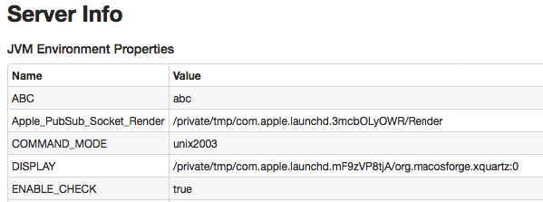

# Job Import

## Description 

Axibase Collector allows to store and import jobs in XML format. The file can contain multiple amounts of jobs.

**Example:**

```xml
<list>
  <com.axibase.collector.model.job.http.HttpJobConfig>
    <name>http-response-time</name>
    <cronExpression>R 0/5 * * * ?</cronExpression>
    <enabled>false</enabled>
    <jobType>HTTP</jobType>
    <defaultTags/>
    <checkLastTime>false</checkLastTime>
    <commitInterval>10</commitInterval>
    <errorThreshold>0</errorThreshold>
    <configurations>
      <com.axibase.collector.model.job.http.HttpConfiguration>
        <name>https://www.google.com/</name>
        <path>https://www.google.com/</path>
        <responseText>Google</responseText>
        <matchType>CONTAINS</matchType>
        <failureRetest>2</failureRetest>
        <failureRetestDelay>15</failureRetestDelay>
        <enableWebDriver>false</enableWebDriver>
        <collectSslMetrics>false</collectSslMetrics>
      </com.axibase.collector.model.job.http.HttpConfiguration>
    </configurations>
  </com.axibase.collector.model.job.http.HttpJobConfig>
</list>
```

## Import Job from file

There are two ways to import job from the XML file: through `Import Page` or by passing special arguments to collector start script.

### Import Page

1. Go to `Jobs` page through the main menu.

2. Click `Import` button to open `Import Page`.

   

3. Click `Browse...` button and select job file or just drag job file and drop it to the button. 

4. Click `Import` button.

5. If Collector successfully processes the file, you see the message: `1 job(s) successfully imported`, otherwise the Collector returns a message with a description of the error.



### Command Line Argument

Collector also allows importing jobs passed by `job-path` argument to start-script. The argument has following format: `-job-path=${path_to_file}`. `${path_to_file}` placeholders represent an absolute or relative path to a local file and HTTP link as well.

```bash
$AXIBASE_COLLECTOR_HOME/bin/start-collector.sh -job-path=/tmp/jobs.xml
```

If the application will encounter problems during import you will see an explicit message in collector log.

## Using Environment variables in job file

Collector resolves environment variables specified in `${VARIABLE_NAME}` format in job file during import. If a variable does not exist the application will not replace it. 

For Example if there is `JAVA_HOME` that set to `/usr/lib/java` variable you can use it in job file:


```xml
<path>${JAVA_HOME}/README.html</path>
```

And collector will import it as

```xml
<path>/usr/lib/java/README.html</path>
```

You can view all available variables on `Admin:Server Info` page in the section `JVM Environment Properties`.




### New environment variables

You should restart Axibase Collector if you want to use newly added environment variables. 

```bash
$AXIBASE_COLLECTOR_HOME/bin/stop-collector.sh
$AXIBASE_COLLECTOR_HOME/bin/start-collector.sh
```
