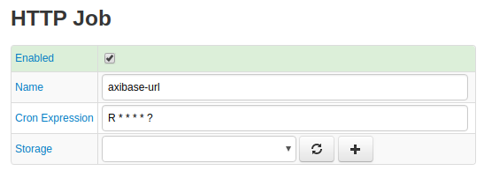
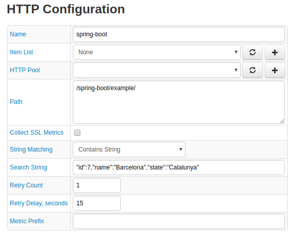

# HTTP

HTTP (Hypertext Transfer Protocol) is the underlying protocol used by the World Wide Web that defines how messages are formatted and transmitted.

## Quick Start

* Download [HTML Job](./resources/job_http_google.com.xml) configuration XML. Job queries `google.com`.
* Open Axibase Collector user interface.
* Click **Jobs**.
* At the bottom of the page, click **Import**.
* Select `job_http_google.com.xml` from the local file system.
* Open the job and click **Run** to collect data.

## HTTP Job Configuration



Use the table below to create an HTTP job configuration.

### Job

| Field         | Description |
|:------------- |:-------------|
| Enabled | The job is active and queried data is stored|
| Name     | Name of the HTTP job configuration. |
| `cron` Expression | Run the job on a [`cron`](../scheduling.md#cron-expressions) schedule.
Storage | Define location to store retrieved series commands.

### Configuration

| Field         | Description |
|:------------- |:-------------|
| Item List| Apply the HTTP job to an [Item List](../collections.md#item-lists). `*`|
| HTTP Pool |  Apply a configured [HTTP pool](./http-pool.md) or create one by clicking **+**. `*` |
| Path |   Path to target files located on the remote or local file system from which HTTP job reads.  |
| Collect SSL Metrics | Collect SSL certificate expiration and status metrics: `http.ssl_certificate_expiration_days` and `http.ssl_certificate_status`.
String Matching | Define how Collector searches for response text.<br>Possible values:<br>`Contains String`: Search for partial match.<br>`Equals String`: Search for exact match.<br>`Matches String`: Search via regular expression.<br>`Does Not Contain String`: Search those strings which do not contain the target string defined in **Search String**.
Search String | Text for which Collector searches.
Retry Count | Number of attempts to re-establish a lost connection.|
Retry Delay, seconds | Delay between attempts to re-establish a lost connection.
Metric Prefix | Common prefix added to metric names, for example `jmx.activemq`.<br>This field supports the following [placeholders](./placeholders.md):<br>`$(domain)`: Domain of the `mbean`<br>`$(name)`: Value of the `mbean` attribute `name`.<br>`$(type)`: Value of the `mbean` attribute `type`.

> `*` Apply the HTTP job to **either** an Item List or HTTP Pool, but not both.

### Collected Metrics

Metric | Description
--|--
`http.connection_time` | Milliseconds required for Collector to establish a connection to the target URL.
`http.download_size` | Size of response in bytes.
`http.download_time` | Milliseconds required for Collector to download response.
`http.ssl_certificate_expiration_days` | Number of days before SSL Certificate expiration.
`http.ssl_certificate_not_after_date` | SSL Certificate expiration date.
`http.ssl_certificate_status` | Returns value based on SSL Certificate status. See the table below.
`http.status` | Returns value based on HTTP status code. See the table below.

#### Date-Based Responses

Metrics which record a date value such as `http.ssl_certificate_not_after_date` are recorded in the following format `yyyyMMdd`. Thus, `20180429` corresponds to April 29, 2018.

#### `http.ssl_certificate_status` Metric Values

Metric Value | Certificate Status
--|--
`0`| Valid
`1`| Self-signed
|`2`| Certificate is already expired.
`3`| Certificate is not yet valid.
`4` | Incorrect hostname.
`5` | Failed to retrieve SSL certificate.

#### `http.status` Metric Values Based on HTTP Response Codes

| Metric Value | Response Code |
|:------------- |:-------------|
| `0` | No error. TCP connection successful. HTTP status code `2xx` or `3xx`. String search successful, if enabled. |
| `1` | `ConnectException` |
| `2` | `NoRouteToHostException` |
| `3` | `UnknownHostException` |
| `4` | `SocketTimeoutException` |
| `5` | Other exceptions without HTTP status code.|
| `10` | TCP connection successful. HTTP status code `2xx` or `3xx`, but string search failed. |
| `11` | TCP connection successful. HTTP status code other than `2xx`, `3xx`, or `4xx`. |

### Configuration Example



Click **Test** to view sample series commands for the given configuration.

```ls
series e:example.org d:2018-07-24T18:00:00.000Z t:name=spring-boot t:url=http://example.org/spring-boot/example/ t:username=axibase m:http.download_size=1889 m:http.status=0 m:http.download_time=14 m:http.connection_time=1
```

The response series command contains the following information:

* The HTTP Job executed at 18:00 on July 24, 2018.
* The queried site `www.example.org/springboot/example` response is 1,889 bytes and took 14 milliseconds to download.
* Valid connection established in one millisecond and the SSL Certificate is valid.

Collector passes this information to ATSD where it is stored and can trigger Alert Responses using the [Rule Engine](https://axibase.com/docs/atsd/rule-engine/), queried using [REST API](https://axibase.com/docs/atsd/api/data/), or added to a streaming [Portal](https://axibase.com/docs/atsd/portals/).