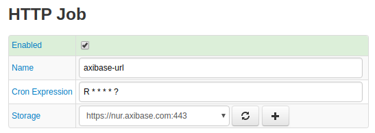
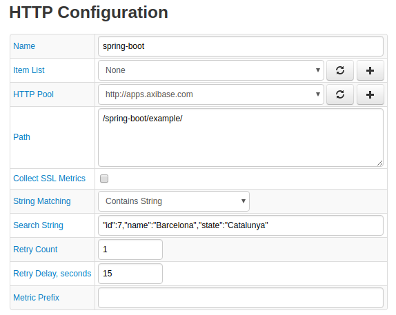

# HTTP

HTTP (Hypertext Transfer Protocol) is the underlying protocol used by the World Wide Web that defines how messages are formatted and transmitted.

## HTTP Job Configuration

Use the table below to create an HTTP job configuration.

| Field         | Description |
|:------------- |:-------------|
| Enabled | The job is active and queried data is stored|
| Name     | Name of the HTTP job configuration. |
| `cron` Expression | Run the job on a [`cron`](../scheduling.md#cron-expressions) schedule.
| Item List| Apply the HTTP job to an [Item List](../collections.md#item-lists) `*`.|
| HTTP Pool |  Name of a configured [HTTP pool](../atsd-server-connection.md#http-pool) to use `*`. |
| Path |   Path to target files located on the remote or local file system from which HTTP job reads.  |
| Response Text |  Text Axibase Collector searches for in the response from the server.   |
| Response Text Match Type |  Defines how Collector searches for response text.   `CONTAINS`: Search for a partial match.    `EQUALS`: Search for an exact match.   `REGEXP`: Search via regular expression. |
| Failure Retest |  Number of attempts to re-establish the connection.   |
| Failure Retest Interval |   Delay between attempts to re-establish connection.    |

> `*` Apply the HTTP job to **either** an Item List or HTTP Pool, but not both.

### `http.status` Metric Values Based on HTTP Response Codes

| Metric Value | Response Code |
|:------------- |:-------------|
| `0` | No error. `HTTP status = 200`. No match configured or response text matched. |
| `1` | `ConnectException` |
| `2` | `NoRouteToHostException` |
| `3` | `UnknownHostException` |
| `4` | `SocketTimeoutException` |
| `5` | Other exceptions without HTTP response status |
| `200` | `HTTP response status = 200`, but response text failed to match. |
| `xxx` | HTTP response status. For example `500 Server Error`. |

### Configuration Example

