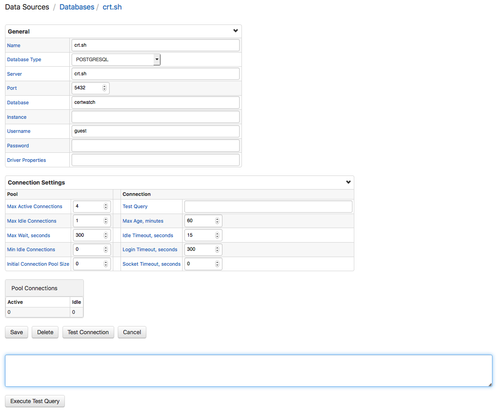

# JDBC Data Source

To add a database as a data source in Axibase Collector, open the **Data Sources > Databases** page and click **New Data Source**.

## General Settings

| Field        | Description  |
|:-------------|:-------------|
| Name | Data source identifier. |
| Database Type  | Type of database.   Possible values: Oracle, MSSQL, MSSQL_Native, DB2, SOLID, MYSQL, POSTGRESQL, SYBASE, DERBY, SAP, PI_SERVER, VERTICA, CUSTOM      |
| Server | IP or hostname of target server. |
| Port | Port on which database listens. |
| Database | Name of the database residing on the database server. |
| Instance | Instance identifying name. |
| Username | Username connecting to the database. The recommended setting is to create a read-only account to access the database. |
| Password | User password. |
| Driver Properties | Extended JDBC diver properties. Specific to each database |

## Connection Settings

### Pool

| Field        | Description  |
|:-------------|:-------------|
| Max Active Connections | Maximum number of active connections. |
| Max Idle Connections | Maximum number of idle connections. |
| Max Wait, seconds | Maximum number of seconds for a job to wait until the job requires a connection from the pool. |
| Min Idle Connections | Minimum number of idle connections. |
| Initial Connection Pool Size | Initial size of the connection pool. |

### Connection

| Field        | Description  |
|:-------------|:-------------|
| Test Query | Test query to keep the connection alive. |
| Max Age, minutes | Maximum duration of the connection, after which the connection is closed and reopened by the database. |
| Idle Timeout, seconds | Duration after which an unused connection is closed. |
| Login Timeout, seconds | Wait duration when opening a connection. |
| Socket Timeout, seconds | Duration after which the connection is dropped if there is no response from the server. |

