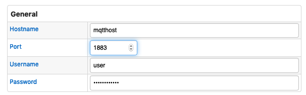
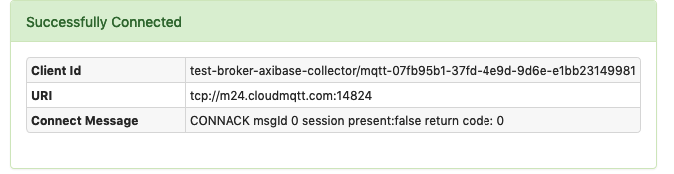

# MQTT Broker

To add a broker in Axibase Collector, open the **Data Sources > MQTT Brokers** page and click **Add**.

## Supported Brokers

[MQTT](https://mqtt.org/) `v3+`

## Settings

**Field** | **Description**
--------- | ---------------
Hostname  | Host of the broker use for the connection
Port | Port to use for the connection
Username | Username to use for the connection
Password | Password to use for the connection

## Screenshots

### Configuration

### Test Result

