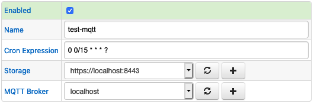
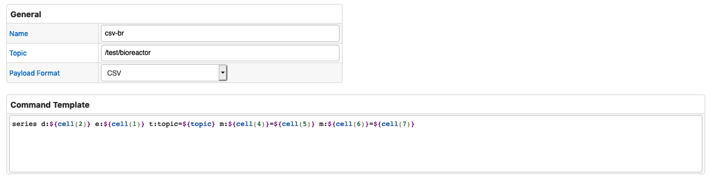
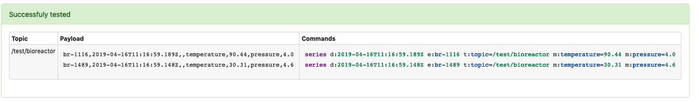
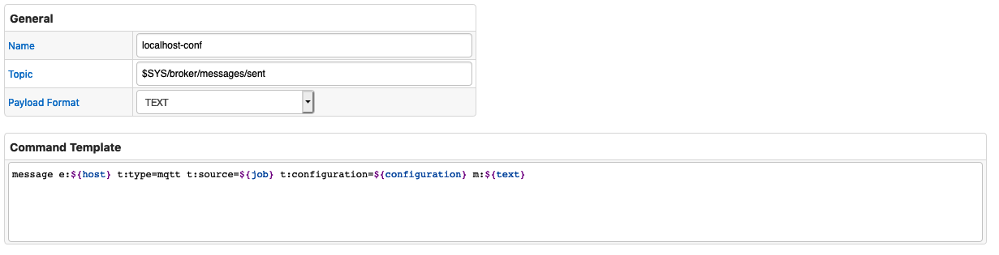
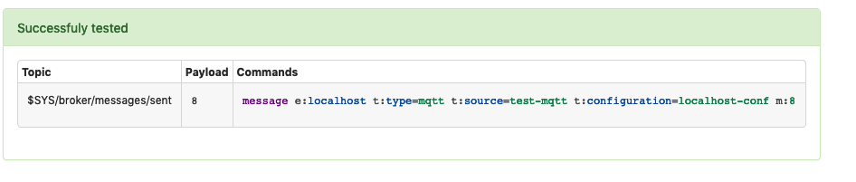
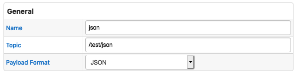
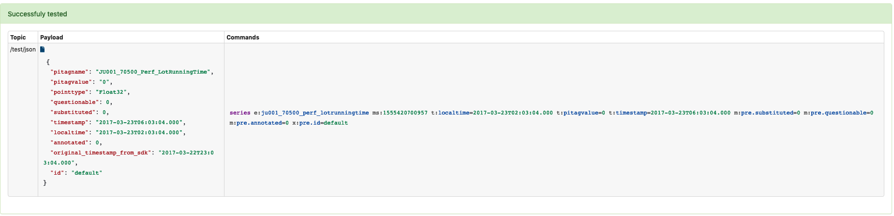

# MQTT Job

## Overview

The Mqtt job provides a way to read messages from an MQTT broker to convert them into series, property, and message commands.

## Job Settings

In comparison to [Generic job](../job-generic.md), MQTT job has an additional **MQTT Broker** field. <br/>
**MQTT Broker** list allows you to select a [consumer](./mqtt-broker.md) to use.



### Job Configuration

To configure a MQTT job, click **Create Configuration**.
Use the table below to set configuration parameters.

**Field** | **Description**
----- | -----------
Topic | The topic to subscribe to, which can include wildcards
Payload Format | Format of the message payload. Supported formats: `JSON`, `CSV`, `TEXT`

## TEXT Settings

If TEXT message format is selected, you must specify freemarker expression to **Command Template** field for mapping message text to ATSD network command.

### Variables

**Name**| **Description**
---|---
`job` | Current Job Name
`configuration` | Current Configuration Name
`text` | Text of processing message
`topic` | Message source topic
`receiveTime` | Time of message delivery in milliseconds
`host` | Broker Host
`port` | Broker Port

## CSV Settings

If CSV message format is selected, you must specify freemarker expression to **Command Template** field for mapping each CSV line text to ATSD network command.

### Variables

All variables for `TEXT` mode are available in `CSV` mode and `line` variable representing current processing line of payload text.

### Methods

**Name**| **Parameters** |  **Description**
---|---|---
`cell` | `id` - index of column | Get line column by index. If index is out of range empty string returns.

### Configuration



Sample Mapping Result:



#### Default Command Template

```injectedfreemarker
message e:${host} t:type=mqtt t:source=${job} t:configuration=${configuration} m:${text}
```

### Configuration Example



Sample Mapping Result:



## JSON Settings

If JSON message format is selected, you need to configure JSON fields mapping to command fields:

### Entity Fields

**Name** | **Description**
---| ---
Entity | Entity name, specified literally or extracted from the specific field in the matched object.
Entity Prefix | Text added to the entity name, retrieved from the specified field. For example, if Entity Prefix is set to `custom.`, and the field value is `my-host`, the resulting entity name is `custom.my-host`.

### Time Fields

**Name** | **Description**
---| ---
Time Default | Specify time value for all commands.
Time Field   | Field with values that specify time for all commands.
Time Format  | Date format applied when parsing time value.
Time Zone    | Timezone can be optionally applied if the extracted date is in local time, otherwise the local Collector time zone is in effect.

### Series Fields

**Name** | **Description**
--- | ---
Metric Prefix | Text added to the metric name. For example, if Metric Prefix is set to `custom.`, and the metric name is `cpu_busy`, the resulting metric name is `custom.cpu_busy`.
Included Fields | By default, all numeric fields from nested objects are included in commands. The list of included fields can be overridden explicitly by specifying their names, separated by comma.
Excluded Fields | List of particular field names to be excluded from commands. Applies when **Included Fields** is empty.
Annotation Fields | List of fields whose values are saved as text annotation along with the numeric value.

**Name** | **Description**
---|---

### Configuration Example




* Sample Mapping Result:

