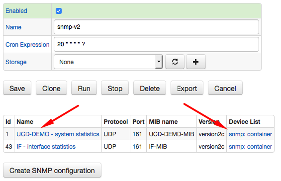
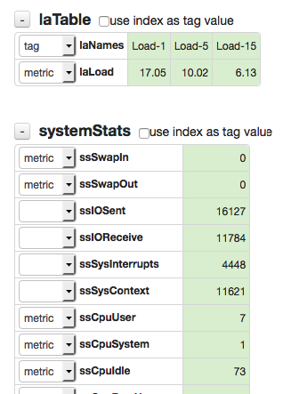
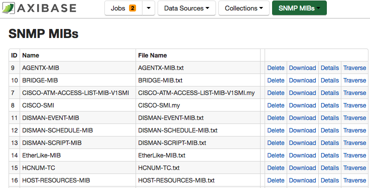
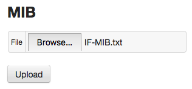
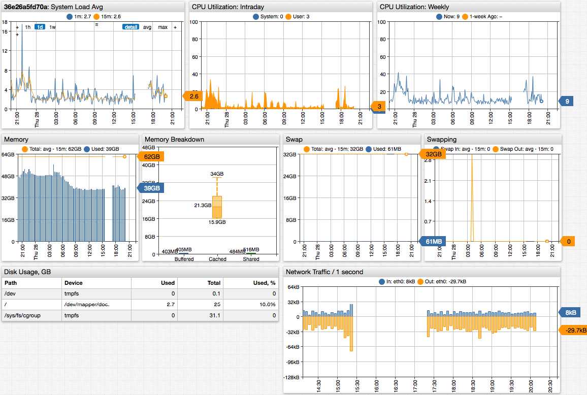
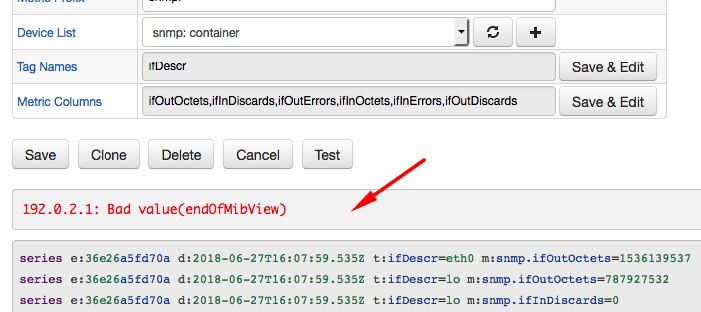

# SNMP Job

The SNMP job collects metrics from IP-addressable devices over the SNMP (Simple Network Management Protocol) protocol. It allows monitoring system availability and performance without installing a custom agent on the target system. The statistics are exposed by a SNMP daemon available by default on network devices and as a package for Linux, Windows, and HP-UX operating systems.

## Prerequisites

* Install `snmp` package on the Collector server.

```bash
apt-get install snmp
```

```bash
yum -y install net-snmp net-snmp-utils
```

* Verify that `snmptranslate -h` utility is installed.

```txt
USAGE: snmptranslate [OPTIONS] OID [OID]...
Version:  5.7.2
...
```

## Quick Start

* Import MIB files into Collector as described in the [Base MIB files](#base-mib-files) section.
* Import [`snmp-os`](./resources/job_snmp_os.xml) SNMP job into the Collector.
* Open the **Collections > Item Lists** page in Collector, specify monitored hosts in the `SNMP Devices` list.
* Open the `snmp-os` job in Collector, open the `system statistics` configuration and click **Test** to check connectivity. Run the job manually to collect initial metric values.
* Log in to ATSD and verify that SNMP metrics are displayed on the **Metrics** tab with the `snmp*` prefix.
* Import [`group-snmp`](./resources/group-snmp.xml) SNMP entity group into ATSD.
* Import [`portal-snmp`](./resources/portal-snmp.xml) SNMP Portal into ATSD. See an example [portal](#snmp-portal) below.

## Job Settings

The SNMP job allows creating multiple configurations to query objects in different [MIB files](#mib-files). The configurations are executed sequentially, while SNMP `GETBULK` operations to remote devices in each configuration are executed in parallel.

Each configuration retrieves pre-defined object values, identified by OID (Object Identifier), from hostnames or IP addresses in the **Device List**. Metrics collected from the same device are sent into ATSD under an entity name based on the device hostname or IP address as specified in the **Device List**.



## Configuration Settings

The settings specify the list of devices to query as well as connection properties.

### Query Settings

| Field          | Description  |
| :------------- |:-------------|
| Device List | List of hostnames or IP addresses to query. |
| Metric Prefix | Prefix added to metric names sent into ATSD. |
| MIB Name | MIB file containing object definitions. |
| Metric OIDs | Object names containing numeric metric values. |
| Series Tag OIDs | Object names containing series tags. |

To populate the list of collected metric objects, click **Configure** button to view the editor.

Enter a hostname or IP address for one of the target systems and click **Load All Values**. Choose which objects to collect. If the object has an additional dimension such as interface or disk name, classify such OID as `tag`.



### Connection Settings

| Field          | Description  |
| :------------- |:-------------|
| Transport | TCP or UDP protocol used for connecting to the devices. |
| Port | TCP or UDP port. |
| Version | SNMP protocol version. |
| Community |  SNMP community name, such as `public`.|
| Timeout, seconds | Number of seconds after which the Collector interrupts the query. `0` or `-1` is unlimited. |
| Retries | Number of connection retries in case of network failure. |
| Maximum Repetitions | Maximum number of iterations over the repeating variables. |
| Non Repeaters | Number of supplied variables that must not be iterated over. |

Supported SNMP protocol versions:

* SNMP `v2c`
* SNMP `v3`

### Security Settings

The following settings apply to SNMP protocol `v3`.

| Field          | Description  |
| :------------- |:-------------|
| Authentication Protocol | Encryption protocol for authentication.<br/>Allowed values: `MD5`, `SHA`. |
| Security Name | Username. |
| Authentication Pass Phrase | Password. |
| Privacy Pass Phrase| Pass phrase for data transmission. |
| Privacy Protocol | Data encryption protocol.<br/>Allowed values: `DES`, `TRIPLE_DES`, `AES128`, `AES192`, `AES256`. |
| Security Level | Allowed values:<br/>`NO_AUTH_NO_PRIV`: no authentication, no encryption. <br/> `AUTH_NO_PRIV`: authentication, no encryption. <br/> `AUTH_PRIV`: authentication and encryption. |

## Testing Connections

Network connectivity between the Collector and a remote system is required.

To check that the SNMP daemon on the target device is reachable, open the SNMP configuration page.

Select a MIB file in the drop-down list.

Fill out connection properties and click **Configure**. The configuration settings are saved automatically, when the configuration editor is launched.

Enter the target hostname or IP address and click **Load All Values**.

## Configuration Example

SNMP configuration example:


Click **Test** to view sample series commands for the given configuration.

```ls
series e:192.0.2.1 d:2018-06-27T11:14:56.481Z m:snmp.laLoad=1.56 t:laNames=Load-1
series e:192.0.2.1 d:2018-06-27T11:14:56.481Z m:snmp.laLoad=2.14 t:laNames=Load-15
series e:192.0.2.1 d:2018-06-27T11:14:56.481Z m:snmp.laLoad=1.97 t:laNames=Load-5
series e:192.0.2.1 d:2018-06-27T11:14:56.481Z m:snmp.memShared=494356
series e:192.0.2.1 d:2018-06-27T11:14:56.481Z m:snmp.memBuffer=403904
series e:192.0.2.1 d:2018-06-27T11:14:56.481Z m:snmp.memTotalReal=65124968
series e:192.0.2.1 d:2018-06-27T11:14:56.481Z m:snmp.memAvailReal=16156972
series e:192.0.2.1 d:2018-06-27T11:14:56.481Z m:snmp.memCached=25270224
series e:192.0.2.1 d:2018-06-27T11:14:56.481Z m:snmp.memTotalFree=49637572
series e:192.0.2.1 d:2018-06-27T11:14:56.481Z m:snmp.memAvailSwap=33480600
series e:192.0.2.1 d:2018-06-27T11:14:56.481Z m:snmp.memTotalSwap=33537916
```

## MIB Files

The SNMP daemon running on the remote system publishes available configuration and performance objects using OIDs (object identifiers).
The OIDs are defined in Management Information Base (MIB) files and contain information such as object name, type, data type etc.

```txt
laLoad .1.3.6.1.4.1.2021.10.1.3

enterprises.ucdavis.laTable.laEntry.laLoad
laLoad OBJECT-TYPE
  -- FROM UCD-SNMP-MIB
  -- TEXTUAL CONVENTION DisplayString
  SYNTAX  OCTET STRING (0..255)
  DISPLAY-HINT  "255a"
  MAX-ACCESS  read-only
  STATUS  current
  DESCRIPTION "The 1,5 and 15 minute load averages (one per row)."
::= { iso(1) org(3) dod(6) internet(1) private(4) enterprises(1) ucdavis(2021) laTable(10) laEntry(1) 3 }
```

The Collector needs access to MIB files to translate OIDs received from the remote systems into object names used in ATSD the metric and series tag names.

```txt
1.3.6.1.4.1.2021.10.1.3 --> laLoad
```

```ls
series e:192.0.2.1 d:2018-06-27T10:09:19.649Z t:laNames=Load-1 m:snmp.laLoad=2.79
```

The SNMP job supports built-in and custom MIB files.



## SNMP MIB Import

Load MIB files into the Collector instance on the **Admin > SNMP MIBs** page.

Perform this task initially, as part of post-installation configuration, as well as when you enable monitoring for a new class of remote systems with custom MIB files.

Open **Admin > SNMP MIBs > Upload MIB** page.

Attach a MIB file and click **Upload**.



The MIB file is validated and translated using the [`snmptranslate`](http://net-snmp.sourceforge.net/tutorial/tutorial-5/commands/snmptranslate.html) utility installed on the underlying Linux operating system. A translated list of OIDs is loaded into the Collector database.

### MIB Tree

MIB format is hierarchical and allows for inheriting definitions from parent MIBs. As a result, you must import parent MIBs first.

```txt
IF-MIB DEFINITIONS ::= BEGIN

IMPORTS
    MODULE-IDENTITY, OBJECT-TYPE, Counter32, Gauge32, Counter64,
    Integer32, TimeTicks, mib-2,
    NOTIFICATION-TYPE                        FROM SNMPv2-SMI
    TEXTUAL-CONVENTION, DisplayString,
    PhysAddress, TruthValue, RowStatus,
    TimeStamp, AutonomousType, TestAndIncr   FROM SNMPv2-TC
    MODULE-COMPLIANCE, OBJECT-GROUP,
    NOTIFICATION-GROUP                       FROM SNMPv2-CONF
    snmpTraps                                FROM SNMPv2-MIB
    IANAifType                               FROM IANAifType-MIB;
```

When you import the MIB file the Collector searches for any parent files, specified in the `IMPORTS` section, among the previously loaded MIB files as well as MIB files stored on the underlying operating system.

System MIB directory location:

* On Linux, the MIB files are stored in the `/usr/share/snmp` directory.
* On HP-UX, the MIB files are stored in the `/var/opt/OV/share/snmp_mibs` [directory](https://nixdoc.net/man-pages/HP-UX/snmpdm.1m.html).

### Base MIB Files

The following table contains links to MIB files for monitoring operating system performance metrics.
Upload the MIB files into your Collector instance in the order specified in the **Priority** column.

| Priority | MIB  | Description  | Dependencies |
|:---|:---|:---|:---|
| 1 | [`SNMPv2-SMI`](./resources/SNMPv2-SMI.txt) | - | - |
| 2 | [`SNMPv2-TC`](./resources/SNMPv2-TC.txt) | Represents textual information taken from the NVT ASCII character set | [`SNMPv2-SMI`](./resources/SNMPv2-SMI.txt) |
| 3 | [`SNMPv2-MIB`](./resources/SNMPv2-MIB.txt) | The MIB module for SNMP entities | [`SNMPv2-TC`](./resources/SNMPv2-SMI.txt) |
| 4 | [`UCD-SNMP-MIB`](./resources/UCD-SNMP-MIB.txt) | System load average, CPU utilization, memory configuration and usage, disk used. | [`SNMPv2-MIB`](./resources/SNMPv2-MIB.txt) |
| 5 | [`IF-MIB`](./resources/IF-MIB.txt) | Network interface counters | [`SNMPv2-MIB`](./resources/SNMPv2-MIB.txt) |

## SNMP Portal



## Troubleshooting

### Connectivity

Test that the target server is accessible using `snmpwalk` utility.

```bash
snmpwalk -v2c -c public udp:192.0.2.1:161
```

```txt
iso.3.6.1.2.1.1.1.0 = STRING: "Linux NURSWGVML007 4.4.0-127-generic #153-Ubuntu SMP Sat May 19 10:58:46 UTC 2018 x86_64"
iso.3.6.1.2.1.1.2.0 = OID: iso.3.6.1.4.1.8072.3.2.10
iso.3.6.1.2.1.1.3.0 = Timeticks: (15651) 0:02:36.51
iso.3.6.1.2.1.1.4.0 = STRING: "john.doe@example.org>"
iso.3.6.1.2.1.1.5.0 = STRING: "192.0.2.1"
...
```

### System View Restriction

On some systems, access to OIDs other than those containing basic information is _disabled_ in by the SNMP daemon.

In case of `Bad value(endOfMibView)` error, modify the SNMP daemon configuration on the target server.



The error is displayed as `end of the MIB tree` at the end of the the `snmpwalk` output.

```txt
...
iso.3.6.1.2.1.25.1.7.0 = No more variables left in this MIB View (It is past the end of the MIB tree)
```

Open the `/etc/snmp/snmpd.conf` file.

#### Ubuntu/Debian

Remove `-V systemonly` restriction from the `rocommunity` setting.

```txt
# rocommunity public default -V systemonly
rocommunity public default
```

Restart the SNMP daemon.

```bash
service snmpd restart
```

#### RHEL/Centos

```txt
#       group          context sec.model sec.level prefix read   write  notif
access  notConfigGroup ""      any       noauth    exact  systemview none none
```

Create a new view named `all` containing all OIDs.

```txt
#       name           incl/excl     subtree         mask(optional)
view    systemview    included   .1.3.6.1.2.1.1
view    systemview    included   .1.3.6.1.2.1.25.1.1
view    all           included   .1
```

Grant the `public` community read-only permissions to the `all` view.

```txt
#       group          context sec.model sec.level prefix read   write  notif
access  notConfigGroup ""      any       noauth    exact  all none none
```

Restart the SNMP daemon to apply the changes.

### Unknown Objects

To check that the remote system publishes operating system OIDs in the `UCD-SNMP-MIB` MIB, execute the `snmpwalk` command with the OID filter set to `1.3.6.1.4.1.2021` (`iso(1) org(3) dod(6) internet(1) private(4) enterprises(1) ucdavis(2021)`).

```bash
snmpwalk -v2c -c public udp:192.0.2.1:161 1.3.6.1.4.1.2021
```

The expected output contains a list of nested OIDs.

```txt
iso.3.6.1.4.1.2021.2.1.1.1 = INTEGER: 1
iso.3.6.1.4.1.2021.2.1.1.2 = INTEGER: 2
iso.3.6.1.4.1.2021.2.1.1.3 = INTEGER: 3
iso.3.6.1.4.1.2021.2.1.2.1 = STRING: "mountd"
iso.3.6.1.4.1.2021.2.1.2.2 = STRING: "ntalkd"
iso.3.6.1.4.1.2021.2.1.2.3 = STRING: "sendmail"
iso.3.6.1.4.1.2021.2.1.3.1 = INTEGER: 1
iso.3.6.1.4.1.2021.2.1.3.2 = INTEGER: 0
iso.3.6.1.4.1.2021.2.1.3.3 = INTEGER: 1
iso.3.6.1.4.1.2021.2.1.4.1 = INTEGER: 0
iso.3.6.1.4.1.2021.2.1.4.2 = INTEGER: 4
iso.3.6.1.4.1.2021.2.1.4.3 = INTEGER: 10
iso.3.6.1.4.1.2021.2.1.5.1 = INTEGER: 0
iso.3.6.1.4.1.2021.2.1.5.2 = INTEGER: 0
...
```

## SNMP Object Reference

### UCD-SNMP-MIB

* Table `prTable`: `1.3.6.1.4.1.2021.2`

  | Object | Description |
  |:---|:---|
  | **`prEntry`**<br/>`1.3.6.1.4.1.2021.2.1` | An entry containing a process and its statistics. |
  | **`prIndex`**<br/>`1.3.6.1.4.1.2021.2.1.1` | Reference Index for each observed process. |
  | **`prNames`**<br/>`1.3.6.1.4.1.2021.2.1.2` | The process name we're counting/checking on. |
  | **`prMin`**<br/>`1.3.6.1.4.1.2021.2.1.3` | The minimum number of processes that must be running. An error setting is generated if the number of running processes is < the minimum. |
  | **`prMax`**<br/>`1.3.6.1.4.1.2021.2.1.4` | The maximum number of processes that must be running. An error setting is generated if the number of running processes is > the maximum. |
  | **`prCount`**<br/>`1.3.6.1.4.1.2021.2.1.5` | The number of current processes running with the name in question. |
  | **`prErrorFlag`**<br/>`1.3.6.1.4.1.2021.2.1.100` | A Error setting to indicate trouble with a process. It goes to `1` if there is an error, `0` if no error. |
  | **`prErrMessage`**<br/>`1.3.6.1.4.1.2021.2.1.101` | An error message describing the problem (if one exists). |
  | **`prErrFix`**<br/>`1.3.6.1.4.1.2021.2.1.102` | Setting this to one tries to fix the problem if the agent has been configured with a script to call to attempt to fix problems automatically using remote snmp operations. |
  | **`prErrFixCmd`**<br/>`1.3.6.1.4.1.2021.2.1.103` | The command that gets run when the `prErrFix` column is set to `1`. |

* Table `memory`: `1.3.6.1.4.1.2021.4`

  | Object | Description |
  |:---|:---|
  | **`memIndex`**<br/>`1.3.6.1.4.1.2021.4.1` | Bogus Index. This must always return the integer `0`. |
  | **`memErrorName`**<br/>`1.3.6.1.4.1.2021.4.2` | Bogus Name. This must always return the string `swap`. |
  | **`memTotalSwap`**<br/>`1.3.6.1.4.1.2021.4.3` | The total amount of swap space configured for this host. |
  | **`memAvailSwap`**<br/>`1.3.6.1.4.1.2021.4.4` | The amount of swap space currently unused or available. |
  | **`memTotalReal`**<br/>`1.3.6.1.4.1.2021.4.5` | The total amount of real/physical memory installed on this host. |
  | **`memAvailReal`**<br/>`1.3.6.1.4.1.2021.4.6` | The amount of real/physical memory currently unused or available. |
  | **`memTotalSwapTXT`**<br/>`1.3.6.1.4.1.2021.4.7` | The total amount of swap space or virtual memory allocated for text pages on this host. This object is not implemented on hosts where the underlying operating system does not distinguish text pages from other uses of swap space or virtual memory. |
  | **`memAvailSwapTXT`**<br/>`1.3.6.1.4.1.2021.4.8` | The amount of swap space or virtual memory currently being used by text pages on this host. This object is not implemented on hosts where the underlying operating system does not distinguish text pages from other uses of swap space or virtual memory. Note that (despite the name), this value reports the amount used, rather than the amount free or available for use. For clarity, this object is being deprecated in favour of `memUsedSwapTXT(16)`. |
  | **`memTotalRealTXT`**<br/>`1.3.6.1.4.1.2021.4.9` | The total amount of real/physical memory allocated for text pages on this host. This object is not implemented on hosts where the underlying operating system does not distinguish text pages from other uses of physical memory. |
  | **`memAvailRealTXT`**<br/>`1.3.6.1.4.1.2021.4.10` | The amount of real/physical memory currently being used by text pages on this host. This object is not implemented on hosts where the underlying operating system does not distinguish text pages from other uses of physical memory. Note that (despite the name), this value reports the amount used, rather than the amount free or available for use. For clarity, this object is being deprecated in favour of `memUsedRealTXT(17)`. |
  | **`memTotalFree`**<br/>`1.3.6.1.4.1.2021.4.11` | The total amount of memory free or available for use on this host. This value typically covers both real memory and swap space or virtual memory. |
  | **`memMinimumSwap`**<br/>`1.3.6.1.4.1.2021.4.12` | The minimum amount of swap space expected to be kept free or available during normal operation of this host. If this value (as reported by `memAvailSwap(4)`) falls below the specified level, then `memSwapError(100)` is set to `1` and an error message made available via `memSwapErrorMsg(101)`. |
  | **`memShared`**<br/>`1.3.6.1.4.1.2021.4.13` | The total amount of real or virtual memory currently allocated for use as shared memory. This object is not implemented on hosts where the underlying operating system does not explicitly identify memory as specifically reserved for this purpose. |
  | **`memBuffer`**<br/>`1.3.6.1.4.1.2021.4.14` | The total amount of real or virtual memory currently allocated for use as memory buffers. This object is not implemented on hosts where the underlying operating system does not explicitly identify memory as specifically reserved for this purpose. |
  | **`memCached`**<br/>`1.3.6.1.4.1.2021.4.15` | The total amount of real or virtual memory currently allocated for use as cached memory. This object is not implemented on hosts where the underlying operating system does not explicitly identify memory as specifically reserved for this purpose. |
  | **`memUsedSwapTXT`**<br/>`1.3.6.1.4.1.2021.4.16` | The amount of swap space or virtual memory currently being used by text pages on this host. This object is not implemented on hosts where the underlying operating system does not distinguish text pages from other uses of swap space or virtual memory. |
  | **`memUsedRealTXT`**<br/>`1.3.6.1.4.1.2021.4.17` | The amount of real/physical memory currently being used by text pages on this host. This object is not implemented on hosts where the underlying operating system does not distinguish text pages from other uses of physical memory. |
  | **`memSwapError`**<br/>`1.3.6.1.4.1.2021.4.100` | Indicates whether the amount of available swap space (as reported by `memAvailSwap(4)`), is less than the specified minimum (defined by `memMinimumSwap(12)`). |
  | **`memSwapErrorMsg`**<br/>`1.3.6.1.4.1.2021.4.101` | Describes whether the amount of available swap space (as reported by `memAvailSwap(4)`), is less than the specified minimum (defined by `memMinimumSwap(12)`). |

* Table `extTable`: `1.3.6.1.4.1.2021.8`

  | Object | Description |
  |:---|:---|
  | **`extEntry`**<br/>`1.3.6.1.4.1.2021.8.1` | An entry containing an extensible script/program and its output. |
  | **`extIndex`**<br/>`1.3.6.1.4.1.2021.8.1.1` | Reference Index for extensible scripts. Simply an integer row number. |
  | **`extNames`**<br/>`1.3.6.1.4.1.2021.8.1.2` | A Short, one name description of the extensible command. |
  | **`extCommand`**<br/>`1.3.6.1.4.1.2021.8.1.3` | The command line to be executed. |
  | **`extResult`**<br/>`1.3.6.1.4.1.2021.8.1.100` | The result code (exit status) from the executed command. |
  | **`extOutput`**<br/>`1.3.6.1.4.1.2021.8.1.101` | The first line of output of the executed command. |
  | **`extErrFix`**<br/>`1.3.6.1.4.1.2021.8.1.102` | Setting this to one tries to fix the problem if the agent has been configured with a script to call to attempt to fix problems automatically using remote snmp operations. |
  | **`extErrFixCmd`**<br/>`1.3.6.1.4.1.2021.8.1.103` | The command that gets run when the `extErrFix` column is set to `1`. |

* Table `dskTable`: `1.3.6.1.4.1.2021.9`

  | Object | Description |
  |:---|:---|
  | **`dskEntry`**<br/>`1.3.6.1.4.1.2021.9.1` | An entry containing a disk and its statistics. |
  | **`dskIndex`**<br/>`1.3.6.1.4.1.2021.9.1.1` | Integer reference number (row number) for the disk `mib`. |
  | **`dskPath`**<br/>`1.3.6.1.4.1.2021.9.1.2` | Path where the disk is mounted. |
  | **`dskDevice`**<br/>`1.3.6.1.4.1.2021.9.1.3` | Path of the device for the partition |
  | **`dskMinimum`**<br/>`1.3.6.1.4.1.2021.9.1.4` | Minimum space required on the disk (in kBytes) before the errors are triggered. Either this or `dskMinPercent` is configured via the agent's `snmpd.conf` file. |
  | **`dskMinPercent`**<br/>`1.3.6.1.4.1.2021.9.1.5` | Percentage of minimum space required on the disk before the errors are triggered. Either this or `dskMinimum` is configured via the agent's `snmpd.conf` file. |
  | **`dskTotal`**<br/>`1.3.6.1.4.1.2021.9.1.6` | Total size of the disk/partition (kBytes) |
  | **`dskAvail`**<br/>`1.3.6.1.4.1.2021.9.1.7` | Available space on the disk |
  | **`dskUsed`**<br/>`1.3.6.1.4.1.2021.9.1.8` | Used space on the disk |
  | **`dskPercent`**<br/>`1.3.6.1.4.1.2021.9.1.9` | Percentage of space used on disk |
  | **`dskPercentNode`**<br/>`1.3.6.1.4.1.2021.9.1.10` | Percentage of inodes used on disk |
  | **`dskTotalLow`**<br/>`1.3.6.1.4.1.2021.9.1.11` | Total size of the disk/partition (kBytes). Together with `dskTotalHigh` composes `64`-bit number. |
  | **`dskTotalHigh`**<br/>`1.3.6.1.4.1.2021.9.1.12` | Total size of the disk/partition (kBytes). Together with `dskTotalLow` composes `64`-bit number. |
  | **`dskAvailLow`**<br/>`1.3.6.1.4.1.2021.9.1.13` | Available space on the disk (kBytes). Together with `dskAvailHigh` composes `64`-bit number. |
  | **`dskAvailHigh`**<br/>`1.3.6.1.4.1.2021.9.1.14` | Available space on the disk (kBytes). Together with `dskAvailLow` composes `64`-bit number. |
  | **`dskUsedLow`**<br/>`1.3.6.1.4.1.2021.9.1.15` | Used space on the disk (kBytes). Together with `dskUsedHigh` composes `64`-bit number. |
  | **`dskUsedHigh`**<br/>`1.3.6.1.4.1.2021.9.1.16` | Used space on the disk (kBytes). Together with `dskUsedLow` composes `64`-bit number. |
  | **`dskErrorFlag`**<br/>`1.3.6.1.4.1.2021.9.1.100` | Error setting signaling that the disk or partition is under the minimum required space configured for it. |
  | **`dskErrorMsg`**<br/>`1.3.6.1.4.1.2021.9.1.101` | A text description providing a warning and the space left on the disk. |

* Table `laTable`: `1.3.6.1.4.1.2021.10`

  | Object | Description |
  |:---|:---|
  | **`laEntry`**<br/>`1.3.6.1.4.1.2021.10.1` | An entry containing a load average and its values. |
  | **`laIndex`**<br/>`1.3.6.1.4.1.2021.10.1.1` | reference index/row number for each observed `loadave`. |
  | **`laNames`**<br/>`1.3.6.1.4.1.2021.10.1.2` | The list of `loadave` names we're watching. |
  | **`laLoad`**<br/>`1.3.6.1.4.1.2021.10.1.3` | The `1`,`5` and `15` minute load averages (one per row). |
  | **`laConfig`**<br/>`1.3.6.1.4.1.2021.10.1.4` | The watch point for load-averages to signal an error. If the load averages rises above this value, the `laErrorFlag` below is set. |
  | **`laLoadInt`**<br/>`1.3.6.1.4.1.2021.10.1.5` | The `1`,`5` and `15` minute load averages as an integer. This is computed by taking the floating point `loadaverage` value and multiplying by `100`, then converting the value to an integer. |
  | **`laLoadFloat`**<br/>`1.3.6.1.4.1.2021.10.1.6` | The `1`,`5` and `15` minute load averages as an opaquely wrapped floating point number. |
  | **`laErrorFlag`**<br/>`1.3.6.1.4.1.2021.10.1.100` | A Error setting to indicate the load-average has crossed its threshold value defined in the `snmpd.conf` file. It is set to `1` if the threshold is crossed, `0` otherwise. |
  | **`laErrMessage`**<br/>`1.3.6.1.4.1.2021.10.1.101` | An error message describing the `loadaverage` and its surpassed watch-point value. |

* Table `systemStats`: `1.3.6.1.4.1.2021.11`

  | Object | Description |
  |:---|:---|
  | **`ssIndex`**<br/>`1.3.6.1.4.1.2021.11.1` | Bogus Index. This must always return the integer `1`. |
  | **`ssErrorName`**<br/>`1.3.6.1.4.1.2021.11.2` | Bogus Name. This must always return the string `systemStats`. |
  | **`ssSwapIn`**<br/>`1.3.6.1.4.1.2021.11.3` | The average amount of memory swapped in from disk, calculated over the last minute. |
  | **`ssSwapOut`**<br/>`1.3.6.1.4.1.2021.11.4` | The average amount of memory swapped out to disk, calculated over the last minute. |
  | **`ssIOSent`**<br/>`1.3.6.1.4.1.2021.11.5` | The average amount of data written to disk or other block device, calculated over the last minute. This object has been deprecated in favour of `ssIORawSent(57)`, which can be used to calculate the same metric, over any specified time period. |
  | **`ssIOReceive`**<br/>`1.3.6.1.4.1.2021.11.6` | The average amount of data read from disk or other block device, calculated over the last minute. This object has been deprecated in favour of `ssIORawReceived(58)`, which can be used to calculate the same metric, over any specified time period. |
  | **`ssSysInterrupts`**<br/>`1.3.6.1.4.1.2021.11.7` | The average rate of interrupts processed (including the clock) calculated over the last minute. This object has been deprecated in favour of `ssRawInterrupts(59)`, which can be used to calculate the same metric, over any specified time period. |
  | **`ssSysContext`**<br/>`1.3.6.1.4.1.2021.11.8` | The average rate of context switches, calculated over the last minute. This object has been deprecated in favour of `ssRawContext(60)`, which can be used to calculate the same metric, over any specified time period. |
  | **`ssCpuUser`**<br/>`1.3.6.1.4.1.2021.11.9` | The percentage of CPU time spent processing user-level code, calculated over the last minute. This object has been deprecated in favour of `ssCpuRawUser(50)`, which can be used to calculate the same metric, over any specified time period. |
  | **`ssCpuSystem`**<br/>`1.3.6.1.4.1.2021.11.10` | The percentage of CPU time spent processing system-level code, calculated over the last minute. This object has been deprecated in favour of `ssCpuRawSystem(52)`, which can be used to calculate the same metric, over any specified time period. |
  | **`ssCpuIdle`**<br/>`1.3.6.1.4.1.2021.11.11` | The percentage of processor time spent idle, calculated over the last minute. This object has been deprecated in favour of `ssCpuRawIdle(53)`, which can be used to calculate the same metric, over any specified time period. |
  | **`ssCpuRawUser`**<br/>`1.3.6.1.4.1.2021.11.50` | The number of `ticks` (typically `1`/`100`s) spent processing user-level code. On a multi-processor system, the `ssCpuRaw*` counters are cumulative over all CPUs, their sum is typically N*`100` for N processors. |
  | **`ssCpuRawNice`**<br/>`1.3.6.1.4.1.2021.11.51` | The number of `ticks` (typically `1`/`100`s) spent processing reduced-priority code. This object is not implemented on hosts where the underlying operating system does not measure this particular CPU metric. On a multi-processor system, the `ssCpuRaw*` counters are cumulative over all CPUs, their sum is typically N*`100` for N processors. |
  | **`ssCpuRawSystem`**<br/>`1.3.6.1.4.1.2021.11.52` | The number of `ticks` (typically `1`/`100`s) spent processing system-level code. On a multi-processor system, the `ssCpuRaw*` counters are cumulative over all CPUs, their sum is typically N*`100` for N processors. This object sometimes is implemented as the combination of the `ssCpuRawWait(54)` and `ssCpuRawKernel(55)` counters, care must be taken when summing the overall raw counters. |
  | **`ssCpuRawIdle`**<br/>`1.3.6.1.4.1.2021.11.53` | The number of `ticks` (typically `1`/`100`s) spent idle. On a multi-processor system, the `ssCpuRaw*` counters are cumulative over all CPUs, their sum is typically N*`100` for N processors. |
  | **`ssCpuRawWait`**<br/>`1.3.6.1.4.1.2021.11.54` | The number of `ticks` (typically `1`/`100`s) spent waiting for IO. This object is not implemented on hosts where the underlying operating system does not measure this particular CPU metric. This time also is included within the `ssCpuRawSystem(52)` counter. On a multi-processor system, the `ssCpuRaw*` counters are cumulative over all CPUs, their sum is typically N*`100` for N processors. |
  | **`ssCpuRawKernel`**<br/>`1.3.6.1.4.1.2021.11.55` | The number of `ticks` (typically `1`/`100`s) spent processing kernel-level code. This object is not implemented on hosts where the underlying operating system does not measure this particular CPU metric. This time also is included within the `ssCpuRawSystem(52)` counter. On a multi-processor system, the `ssCpuRaw*` counters are cumulative over all CPUs, their sum is typically N*`100` for N processors. |
  | **`ssCpuRawInterrupt`**<br/>`1.3.6.1.4.1.2021.11.56` | The number of `ticks` (typically `1`/`100`s) spent processing hardware interrupts. This object is not implemented on hosts where the underlying operating system does not measure this particular CPU metric. On a multi-processor system, the `ssCpuRaw*` counters are cumulative over all CPUs, their sum is typically N*`100` for N processors. |
  | **`ssIORawSent`**<br/>`1.3.6.1.4.1.2021.11.57` | Number of blocks sent to a block device |
  | **`ssIORawReceived`**<br/>`1.3.6.1.4.1.2021.11.58` | Number of blocks received from a block device |
  | **`ssRawInterrupts`**<br/>`1.3.6.1.4.1.2021.11.59` | Number of interrupts processed |
  | **`ssRawContexts`**<br/>`1.3.6.1.4.1.2021.11.60` | Number of context switches |
  | **`ssCpuRawSoftIRQ`**<br/>`1.3.6.1.4.1.2021.11.61` | The number of `ticks` (typically `1`/`100`s) spent processing software interrupts. This object is not implemented on hosts where the underlying operating system does not measure this particular CPU metric. On a multi-processor system, the `ssCpuRaw*` counters are cumulative over all CPUs, their sum is typically N*`100` for N processors. |
  | **`ssRawSwapIn`**<br/>`1.3.6.1.4.1.2021.11.62` | Number of blocks swapped in |
  | **`ssRawSwapOut`**<br/>`1.3.6.1.4.1.2021.11.63` | Number of blocks swapped out |

* Table `fileTable`: `1.3.6.1.4.1.2021.15`

  | Object | Description |
  |:---|:---|
  | **`fileEntry`**<br/>`1.3.6.1.4.1.2021.15.1` | Entry of file |
  | **`fileIndex`**<br/>`1.3.6.1.4.1.2021.15.1.1` | Index of file |
  | **`fileName`**<br/>`1.3.6.1.4.1.2021.15.1.2` | Filename |
  | **`fileSize`**<br/>`1.3.6.1.4.1.2021.15.1.3` | Size of file (kB) |
  | **`fileMax`**<br/>`1.3.6.1.4.1.2021.15.1.4` | Limit of `filesize` (kB) |
  | **`fileErrorFlag`**<br/>`1.3.6.1.4.1.2021.15.1.100` | Limit exceeded setting |
  | **`fileErrorMsg`**<br/>`1.3.6.1.4.1.2021.15.1.101` | `Filesize` error message |

* Table `logMatch`: `1.3.6.1.4.1.2021.16`

  | Object | Description |
  |:---|:---|
  | **`logMatchMaxEntries`**<br/>`1.3.6.1.4.1.2021.16.1` | The maximum number of `logmatch` entries this `snmpd` daemon can support. |
  | **`logMatchTable`**<br/>`1.3.6.1.4.1.2021.16.2` | Table of monitored files. |
  | **`logMatchEntry`**<br/>`1.3.6.1.4.1.2021.16.2.1` | Entry of file |
  | **`logMatchIndex`**<br/>`1.3.6.1.4.1.2021.16.2.1.1` | Index of `logmatch` |
  | **`logMatchName`**<br/>`1.3.6.1.4.1.2021.16.2.1.2` | `logmatch` instance name |
  | **`logMatchFilename`**<br/>`1.3.6.1.4.1.2021.16.2.1.3` | filename to be `logmatched` |
  | **`logMatchRegEx`**<br/>`1.3.6.1.4.1.2021.16.2.1.4` | regular expression |
  | **`logMatchGlobalCounter`**<br/>`1.3.6.1.4.1.2021.16.2.1.5` | global count of matches |
  | **`logMatchGlobalCounter`**<br/>`1.3.6.1.4.1.2021.16.2.1.5` | Description. |
  | **`logMatchCurrentCounter`**<br/>`1.3.6.1.4.1.2021.16.2.1.7` | Regular expression match counter. This counter resets with each log file rotation. |
  | **`logMatchCurrentCounter`**<br/>`1.3.6.1.4.1.2021.16.2.1.7` | Description. |
  | **`logMatchCounter`**<br/>`1.3.6.1.4.1.2021.16.2.1.9` | Regular expression match counter. This counter resets with each read |
  | **`logMatchCounter`**<br/>`1.3.6.1.4.1.2021.16.2.1.9` | Description. |
  | **`logMatchCycle`**<br/>`1.3.6.1.4.1.2021.16.2.1.11` | time between updates (if not queried) in seconds |
  | **`logMatchErrorFlag`**<br/>`1.3.6.1.4.1.2021.16.2.1.100` | error setting: is this line configured correctly? |
  | **`logMatchRegExCompilation`**<br/>`1.3.6.1.4.1.2021.16.2.1.101` | message of regular expression `precompilation` |

* Table `version`: `1.3.6.1.4.1.2021.100`

  | Object | Description |
  |:---|:---|
  | **`versionIndex`**<br/>`1.3.6.1.4.1.2021.100.1` | Index to `mib` (always `0`) |
  | **`versionTag`**<br/>`1.3.6.1.4.1.2021.100.2` | CVS tag keyword |
  | **`versionDate`**<br/>`1.3.6.1.4.1.2021.100.3` | Date string from RCS keyword |
  | **`versionCDate`**<br/>`1.3.6.1.4.1.2021.100.4` | Date string from `ctime()`  |
  | **`versionIdent`**<br/>`1.3.6.1.4.1.2021.100.5` | Id string from RCS keyword |
  | **`versionConfigureOptions`**<br/>`1.3.6.1.4.1.2021.100.6` | Options passed to the configure script when this agent is built. |
  | **`versionClearCache`**<br/>`1.3.6.1.4.1.2021.100.10` | Set to `1` to clear the `exec` cache, if enabled |
  | **`versionUpdateConfig`**<br/>`1.3.6.1.4.1.2021.100.11` | Set to `1` to read-read the config file(s). |
  | **`versionRestartAgent`**<br/>`1.3.6.1.4.1.2021.100.12` | Set to `1` to restart the agent. |
  | **`versionSavePersistentData`**<br/>`1.3.6.1.4.1.2021.100.13` | Set to `1` to force the agent to save it's persistent data immediately. |
  | **`versionDoDebugging`**<br/>`1.3.6.1.4.1.2021.100.20` | Set to `1` to turn debugging statements on in the agent or `0` to turn it off. |

* Table `snmperrs`: `1.3.6.1.4.1.2021.101`

  | Object | Description |
  |:---|:---|
  | **`snmperrIndex`**<br/>`1.3.6.1.4.1.2021.101.1` | Bogus Index for `snmperrs` (always `0`). |
  | **`snmperrNames`**<br/>`1.3.6.1.4.1.2021.101.2` | snmp |
  | **`snmperrErrorFlag`**<br/>`1.3.6.1.4.1.2021.101.100` | A Error setting to indicate trouble with the agent. It goes to `1` if there is an error, `0` if no error. |
  | **`snmperrErrMessage`**<br/>`1.3.6.1.4.1.2021.101.101` | An error message describing the problem (if one exists). |

* Table `mrTable`: `1.3.6.1.4.1.2021.102`

  | Object | Description |
  |:---|:---|
  | **`mrEntry`**<br/>`1.3.6.1.4.1.2021.102.1` | An entry containing a registered `mib` `oid`. |
  | **`mrIndex`**<br/>`1.3.6.1.4.1.2021.102.1.1` | The registry slot of a `mibmodule`. |
  | **`mrModuleName`**<br/>`1.3.6.1.4.1.2021.102.1.2` | The module name that registered this OID. |

### IF-MIB

* Table `ifTable`: `1.3.6.1.2.1.2.2`

  | Object | Description |
  |:---|:---|
  | **`ifEntry`**<br/>`1.3.6.1.2.1.2.2.1` | An entry containing management information applicable to a particular interface. |
  | **`ifIndex`**<br/>`1.3.6.1.2.1.2.2.1.1` | A unique value, greater than zero, for each interface. It is recommended that values are assigned contiguously starting from `1`. The value for each interface sub-layer must remain constant at least from one re-initialization of the entity's network management system to the next re- initialization. |
  | **`ifDescr`**<br/>`1.3.6.1.2.1.2.2.1.2` | A textual string containing information about the interface. This string must include the name of the manufacturer, the product name and the version of the interface hardware/software. |
  | **`ifType`**<br/>`1.3.6.1.2.1.2.2.1.3` | The type of interface. Additional values for `ifType` are assigned by the Internet Assigned Numbers Authority (IANA), through updating the syntax of the `IANAifType` textual convention. |
  | **`ifMtu`**<br/>`1.3.6.1.2.1.2.2.1.4` | The size of the largest packet which can be sent/received on the interface, specified in octets. For interfaces that are used for transmitting network datagrams, this is the size of the largest network datagram that can be sent on the interface. |
  | **`ifSpeed`**<br/>`1.3.6.1.2.1.2.2.1.5` | An estimate of the interface's current bandwidth in bits per second. For interfaces which do not vary in bandwidth or for those where no accurate estimation can be made, this object must contain the nominal bandwidth. If the bandwidth of the interface is greater than the maximum value reportable by this object then this object must report its maximum value (`4,294,967,295`) and `ifHighSpeed` must be used to report the interface's speed. For a sub-layer which has no concept of bandwidth, this object must be zero. |
  | **`ifPhysAddress`**<br/>`1.3.6.1.2.1.2.2.1.6` | The interface's address at its protocol sub-layer. For example, for an `802.x` interface, this object normally contains a MAC address. The interface's media-specific MIB must define the bit and byte ordering and the format of the value of this object. For interfaces which do not have such an address (e.g., a serial line), this object must contain an octet string of zero length. |
  | **`ifAdminStatus`**<br/>`1.3.6.1.2.1.2.2.1.7` | The target state of the interface. The `testing(3)` state indicates that no operational packets can be passed. When a managed system initializes, all interfaces start with `ifAdminStatus` in the `down(2)` state. As a result of either explicit management action or per configuration information retained by the managed system, `ifAdminStatus` is then changed to either the `up(1)` or `testing(3)` states (or remains in the `down(2)` state). |
  | **`ifOperStatus`**<br/>`1.3.6.1.2.1.2.2.1.8` | The current operational state of the interface. The testing(3) state indicates that no operational packets can be passed. If `ifAdminStatus` is down(2) then `ifOperStatus` must be `down(2)`. If `ifAdminStatus` is changed to `up(1)` then `ifOperStatus` must change to `up(1)` if the interface is ready to transmit and receive network traffic; it must change to `dormant(5)` if the interface is waiting for external actions (such as a serial line waiting for an incoming connection); it must remain in the `down(2)` state if and only if there is a fault that prevents it from going to the `up(1)` state; it must remain in the `notPresent(6)` state if the interface has missing (typically, hardware) components. |
  | **`ifLastChange`**<br/>`1.3.6.1.2.1.2.2.1.9` | The value of `sysUpTime` at the time the interface entered its current operational state. If the current state is entered prior to the last re-initialization of the local network management subsystem, then this object contains a zero value. |
  | **`ifInOctets`**<br/>`1.3.6.1.2.1.2.2.1.10` | The total number of octets received on the interface, including framing characters. Discontinuities in the value of this counter can occur at re-initialization of the management system, and at other times as indicated by the value of `ifCounterDiscontinuityTime`. |
  | **`ifInUcastPkts`**<br/>`1.3.6.1.2.1.2.2.1.11` | The number of packets, delivered by this sub-layer to a higher (sub-)layer, which are not addressed to a multicast or broadcast address at this sub-layer. Discontinuities in the value of this counter can occur at re-initialization of the management system, and at other times as indicated by the value of `ifCounterDiscontinuityTime`. |
  | **`ifInNUcastPkts`**<br/>`1.3.6.1.2.1.2.2.1.12` | The number of packets, delivered by this sub-layer to a higher (sub-)layer, which are addressed to a multicast or broadcast address at this sub-layer. Discontinuities in the value of this counter can occur at re-initialization of the management system, and at other times as indicated by the value of `ifCounterDiscontinuityTime`. This object is deprecated in favour of `ifInMulticastPkts` and `ifInBroadcastPkts`. |
  | **`ifInDiscards`**<br/>`1.3.6.1.2.1.2.2.1.13` | The number of inbound packets which are chosen to be discarded even though no errors are detected to prevent their being deliverable to a higher-layer protocol. One possible reason for discarding such a packet is to free up buffer space. Discontinuities in the value of this counter can occur at re-initialization of the management system, and at other times as indicated by the value of `ifCounterDiscontinuityTime`. |
  | **`ifInErrors`**<br/>`1.3.6.1.2.1.2.2.1.14` | For packet-oriented interfaces, the number of inbound packets that contained errors preventing them from being deliverable to a higher-layer protocol. For character- oriented or fixed-length interfaces, the number of inbound transmission units that contained errors preventing them from being deliverable to a higher-layer protocol. Discontinuities in the value of this counter can occur at re-initialization of the management system, and at other times as indicated by the value of `ifCounterDiscontinuityTime`. |
  | **`ifInUnknownProtos`**<br/>`1.3.6.1.2.1.2.2.1.15` | For packet-oriented interfaces, the number of packets received via the interface which are discarded because of an unknown or unsupported protocol. For character-oriented or fixed-length interfaces that support protocol multiplexing the number of transmission units received via the interface which are discarded because of an unknown or unsupported protocol. For any interface that does not support protocol multiplexing, this counter always is `0`. Discontinuities in the value of this counter can occur at re-initialization of the management system, and at other times as indicated by the value of `ifCounterDiscontinuityTime`. |
  | **`ifOutOctets`**<br/>`1.3.6.1.2.1.2.2.1.16` | The total number of octets transmitted out of the interface, including framing characters. Discontinuities in the value of this counter can occur at re-initialization of the management system, and at other times as indicated by the value of `ifCounterDiscontinuityTime`. |
  | **`ifOutUcastPkts`**<br/>`1.3.6.1.2.1.2.2.1.17` | The total number of packets that higher-level protocols requested be transmitted, and which are not addressed to a multicast or broadcast address at this sub-layer, including those that are discarded or not sent. Discontinuities in the value of this counter can occur at re-initialization of the management system, and at other times as indicated by the value of `ifCounterDiscontinuityTime`. |
  | **`ifOutNUcastPkts`**<br/>`1.3.6.1.2.1.2.2.1.18` | The total number of packets that higher-level protocols requested be transmitted, and which are addressed to a multicast or broadcast address at this sub-layer, including those that are discarded or not sent. Discontinuities in the value of this counter can occur at re-initialization of the management system, and at other times as indicated by the value of `ifCounterDiscontinuityTime`. This object is deprecated in favour of `ifOutMulticastPkts` and `ifOutBroadcastPkts`. |
  | **`ifOutDiscards`**<br/>`1.3.6.1.2.1.2.2.1.19` | The number of outbound packets which are chosen to be discarded even though no errors are detected to prevent their being transmitted. One possible reason for discarding such a packet is to free up buffer space. Discontinuities in the value of this counter can occur at re-initialization of the management system, and at other times as indicated by the value of `ifCounterDiscontinuityTime`. |
  | **`ifOutErrors`**<br/>`1.3.6.1.2.1.2.2.1.20` | For packet-oriented interfaces, the number of outbound packets that are not transmitted because of errors. For character-oriented or fixed-length interfaces, the number of outbound transmission units that are not transmitted because of errors. Discontinuities in the value of this counter can occur at re-initialization of the management system, and at other times as indicated by the value of `ifCounterDiscontinuityTime`. |
  | **`ifOutQLen`**<br/>`1.3.6.1.2.1.2.2.1.21` | The length of the output packet queue (in packets). |
  | **`ifSpecific`**<br/>`1.3.6.1.2.1.2.2.1.22` | A reference to MIB definitions specific to the particular media being used to realize the interface. It is recommended that this value point to an instance of a MIB object in the media-specific MIB, i.e., that this object have the semantics associated with the InstancePointer textual convention defined in RFC `2579`. In fact, it is recommended that the media-specific MIB specify what value `ifSpecific` must/can take for values of `ifType`. If no MIB definitions specific to the particular media are available, the value must be set to the OBJECT IDENTIFIER { `0` `0` }. |

* Table `ifMIB`: `1.3.6.1.2.1.31`

  | Object | Description |
  |:---|:---|
  | **`ifMIBObjects`**<br/>`1.3.6.1.2.1.31.1` | This data type is used to model an administratively assigned name of the owner of a resource. This information is taken from the NVT ASCII character set. It is suggested that this name contain one or more of the following: ASCII form of the manager station's transport address, management station name (e.g., domain name), network management personnel's name, location, or phone number. In some cases the agent itself is the owner of an entry. In these cases, this string shall be set to a string starting with `agent`. |
  | **`ifXTable`**<br/>`1.3.6.1.2.1.31.1.1` | A list of interface entries. The number of entries is given by the value of `ifNumber`. This table contains additional objects for the interface table. |
  | **`ifXEntry`**<br/>`1.3.6.1.2.1.31.1.1.1` | An entry containing additional management information applicable to a particular interface. |
  | **`ifName`**<br/>`1.3.6.1.2.1.31.1.1.1.1` | The textual name of the interface. The value of this object must be the name of the interface as assigned by the local device and must be suitable for use in commands entered at the device's `console`. This might be a text name, such as `le0` or a simple port number, such as `1`, depending on the interface naming syntax of the device. If several entries in the `ifTable` together represent a single interface as named by the device, then each has the same value of `ifName`. Note that for an agent which responds to SNMP queries concerning an interface on some other (proxied) device, then the value of `ifName` for such an interface is the proxied device's local name for it. If there is no local name, or this object is otherwise not applicable, then this object contains a zero-length string. |
  | **`ifInMulticastPkts`**<br/>`1.3.6.1.2.1.31.1.1.1.2` | The number of packets, delivered by this sub-layer to a higher (sub-)layer, which are addressed to a multicast address at this sub-layer. For a MAC layer protocol, this includes both Group and Functional addresses. Discontinuities in the value of this counter can occur at re-initialization of the management system, and at other times as indicated by the value of `ifCounterDiscontinuityTime`. |
  | **`ifInBroadcastPkts`**<br/>`1.3.6.1.2.1.31.1.1.1.3` | The number of packets, delivered by this sub-layer to a higher (sub-)layer, which are addressed to a broadcast address at this sub-layer. Discontinuities in the value of this counter can occur at re-initialization of the management system, and at other times as indicated by the value of `ifCounterDiscontinuityTime`. |
  | **`ifOutMulticastPkts`**<br/>`1.3.6.1.2.1.31.1.1.1.4` | The total number of packets that higher-level protocols requested be transmitted, and which are addressed to a multicast address at this sub-layer, including those that are discarded or not sent. For a MAC layer protocol, this includes both Group and Functional addresses. Discontinuities in the value of this counter can occur at re-initialization of the management system, and at other times as indicated by the value of `ifCounterDiscontinuityTime`. |
  | **`ifOutBroadcastPkts`**<br/>`1.3.6.1.2.1.31.1.1.1.5` | The total number of packets that higher-level protocols requested be transmitted, and which are addressed to a broadcast address at this sub-layer, including those that are discarded or not sent. Discontinuities in the value of this counter can occur at re-initialization of the management system, and at other times as indicated by the value of `ifCounterDiscontinuityTime`. |
  | **`ifHCInOctets`**<br/>`1.3.6.1.2.1.31.1.1.1.6` | The total number of octets received on the interface, including framing characters. This object is a `64`-bit version of `ifInOctets`. Discontinuities in the value of this counter can occur at re-initialization of the management system, and at other times as indicated by the value of `ifCounterDiscontinuityTime`. |
  | **`ifHCInUcastPkts`**<br/>`1.3.6.1.2.1.31.1.1.1.7` | The number of packets, delivered by this sub-layer to a higher (sub-)layer, which are not addressed to a multicast or broadcast address at this sub-layer. This object is a `64`-bit version of `ifInUcastPkts`. Discontinuities in the value of this counter can occur at re-initialization of the management system, and at other times as indicated by the value of `ifCounterDiscontinuityTime`. |
  | **`ifHCInMulticastPkts`**<br/>`1.3.6.1.2.1.31.1.1.1.8` | The number of packets, delivered by this sub-layer to a higher (sub-)layer, which are addressed to a multicast address at this sub-layer. For a MAC layer protocol, this includes both Group and Functional addresses. This object is a `64`-bit version of `ifInMulticastPkts`. Discontinuities in the value of this counter can occur at re-initialization of the management system, and at other times as indicated by the value of `ifCounterDiscontinuityTime`. |
  | **`ifHCInBroadcastPkts`**<br/>`1.3.6.1.2.1.31.1.1.1.9` | The number of packets, delivered by this sub-layer to a higher (sub-)layer, which are addressed to a broadcast address at this sub-layer. This object is a `64`-bit version of `ifInBroadcastPkts`. Discontinuities in the value of this counter can occur at re-initialization of the management system, and at other times as indicated by the value of `ifCounterDiscontinuityTime`. |
  | **`ifHCOutOctets`**<br/>`1.3.6.1.2.1.31.1.1.1.10` | The total number of octets transmitted out of the interface, including framing characters. This object is a `64`-bit version of `ifOutOctets`. Discontinuities in the value of this counter can occur at re-initialization of the management system, and at other times as indicated by the value of `ifCounterDiscontinuityTime`. |
  | **`ifHCOutUcastPkts`**<br/>`1.3.6.1.2.1.31.1.1.1.11` | The total number of packets that higher-level protocols requested be transmitted, and which are not addressed to a multicast or broadcast address at this sub-layer, including those that are discarded or not sent. This object is a `64`-bit version of `ifOutUcastPkts`. Discontinuities in the value of this counter can occur at re-initialization of the management system, and at other times as indicated by the value of `ifCounterDiscontinuityTime`. |
  | **`ifHCOutMulticastPkts`**<br/>`1.3.6.1.2.1.31.1.1.1.12` | The total number of packets that higher-level protocols requested be transmitted, and which are addressed to a multicast address at this sub-layer, including those that are discarded or not sent. For a MAC layer protocol, this includes both Group and Functional addresses. This object is a `64`-bit version of `ifOutMulticastPkts`. Discontinuities in the value of this counter can occur at re-initialization of the management system, and at other times as indicated by the value of `ifCounterDiscontinuityTime`. |
  | **`ifHCOutBroadcastPkts`**<br/>`1.3.6.1.2.1.31.1.1.1.13` | The total number of packets that higher-level protocols requested be transmitted, and which are addressed to a broadcast address at this sub-layer, including those that are discarded or not sent. This object is a `64`-bit version of `ifOutBroadcastPkts`. Discontinuities in the value of this counter can occur at re-initialization of the management system, and at other times as indicated by the value of `ifCounterDiscontinuityTime`. |
  | **`ifLinkUpDownTrapEnable`**<br/>`1.3.6.1.2.1.31.1.1.1.14` | Indicates whether `linkUp`/`linkDown` traps must be generated for this interface. By default, this object must have the value enabled(1) for interfaces which do not operate on `top` of any other interface (as defined in the `ifStackTable`), and `disabled(2)` otherwise. |
  | **`ifHighSpeed`**<br/>`1.3.6.1.2.1.31.1.1.1.15` | An estimate of the interface's current bandwidth in units of `1,000,000` bits per second. If this object reports a value of `n` then the speed of the interface is somewhere in the range of `n-500,000` to `n+499,999`. For interfaces which do not vary in bandwidth or for those where no accurate estimation can be made, this object must contain the nominal bandwidth. For a sub-layer which has no concept of bandwidth, this object must be zero. |
  | **`ifPromiscuousMode`**<br/>`1.3.6.1.2.1.31.1.1.1.16` | This object has a value of `false(2)` if this interface only accepts packets/frames that are addressed to this station. This object has a value of `true(1)` when the station accepts all packets/frames transmitted on the media. The value `true(1)` is only legal on certain types of media. If legal, setting this object to a value of `true(1)` requires the interface to be reset before becoming effective. The value of `ifPromiscuousMode` does not affect the reception of broadcast and multicast packets/frames by the interface. |
  | **`ifConnectorPresent`**<br/>`1.3.6.1.2.1.31.1.1.1.17` | This object has the value `true(1)` if the interface sub-layer has a physical connector and the value `false(2)` otherwise. |
  | **`ifAlias`**<br/>`1.3.6.1.2.1.31.1.1.1.18` | This object is an `alias` name for the interface as specified by a network manager, and provides a non-volatile `handle` for the interface. On the first instantiation of an interface, the value of `ifAlias` associated with that interface is the zero-length string. As and when a value is written into an instance of `ifAlias` through a network management set operation, then the agent must retain the supplied value in the `ifAlias` instance associated with the same interface for as long as that interface remains instantiated, including across all re-initializations/reboots of the network management system, including those which result in a change of the interface's `ifIndex` value. An example of the value which a network manager might store in this object for a WAN interface is the (`Telco's`) circuit number/identifier of the interface. Some agents support write-access only for interfaces having particular values of `ifType`. An agent which supports write access to this object is required to keep the value in non-volatile storage, but it limits the length of new values depending on how much storage is already occupied by the current values for other interfaces. |
  | **`ifCounterDiscontinuityTime`**<br/>`1.3.6.1.2.1.31.1.1.1.19` | The value of `sysUpTime` on the most recent occasion at which any one or more of this interface's counters suffered a discontinuity. The relevant counters are the specific instances associated with this interface of any `Counter32` or `Counter64` object contained in the `ifTable` or `ifXTable`. If no such discontinuities have occurred since the last re- initialization of the local management subsystem, then this object contains a zero value. |
  | **`ifStackTable`**<br/>`1.3.6.1.2.1.31.1.2` | The table containing information on the relationships between the multiple sub-layers of network interfaces. In particular, it contains information on which sub-layers run 'on top of' which other sub-layers, where each sub-layer corresponds to a conceptual row in the `ifTable`. For example, when the sub-layer with `ifIndex` value x runs over the sub-layer with `ifIndex` value y, then this table contains: `ifStackStatus.x.y=active` For each `ifIndex` value, I, which identifies an active interface, there are always at least two instantiated rows in this table associated with I. For one of these rows, I is the value of `ifStackHigherLayer`; for the other, I is the value of `ifStackLowerLayer`. (If I is not involved in multiplexing, then these are the only two rows associated with I.) For example, two rows exist even for an interface which has no others stacked on top or below it: `ifStackStatus.0.x=active ifStackStatus.x.0=active`  |
  | **`ifStackEntry`**<br/>`1.3.6.1.2.1.31.1.2.1` | Information on a particular relationship between two sub-layers, specifying that one sub-layer runs on `top` of the other sub-layer. Each sub-layer corresponds to a conceptual row in the `ifTable`. |
  | **`ifStackHigherLayer`**<br/>`1.3.6.1.2.1.31.1.2.1.1` | The value of `ifIndex` corresponding to the higher sub-layer of the relationship, i.e., the sub-layer which runs on `top` of the sub-layer identified by the corresponding instance of `ifStackLowerLayer`. If there is no higher sub-layer (below the internetwork layer), then this object has the value `0`. |
  | **`ifStackLowerLayer`**<br/>`1.3.6.1.2.1.31.1.2.1.2` | The value of `ifIndex` corresponding to the lower sub-layer of the relationship, i.e., the sub-layer which runs `below` the sub-layer identified by the corresponding instance of `ifStackHigherLayer`. If there is no lower sub-layer, then this object has the value `0`. |
  | **`ifStackStatus`**<br/>`1.3.6.1.2.1.31.1.2.1.3` | The status of the relationship between two sub-layers. Changing the value of this object from `active` to `notInService` or `destroy` has consequences up and down the interface stack. Thus, write access to this object is likely to be inappropriate for some types of interfaces, and many implementations choose not to support write-access for any type of interface. |
  | **`ifTestTable`**<br/>`1.3.6.1.2.1.31.1.3` | This table contains one entry per interface. It defines objects which allow a network manager to instruct an agent to test an interface for various faults.  Tests for an interface are defined in the media-specific MIB for that interface.  After invoking a test, the object `ifTestResult` can be read to determine the outcome.  If an agent can not perform the test, `ifTestResult` is set to indicate.  The object `ifTestCode` can be used to provide further test-specific or interface-specific (or even enterprise-specific) information concerning the outcome of the test.  Only one test can be in progress on each interface at any one time. If one test is in progress when another test is invoked, the second test is rejected.  Some agents reject a test when a prior test is active on another interface. |
  | **`ifTestEntry`**<br/>`1.3.6.1.2.1.31.1.3.1` | An entry containing objects for invoking tests on an interface. |
  | **`ifTestId`**<br/>`1.3.6.1.2.1.31.1.3.1.1` | This object identifies the current invocation of the interface's test. |
  | **`ifTestStatus`**<br/>`1.3.6.1.2.1.31.1.3.1.2` | This object indicates whether or not some manager currently has the necessary `ownership` required to invoke a test on this interface. A write to this object is only successful when it changes its value from `notInUse(1)` to `inUse(2)`. After completion of a test, the agent resets the value back to `notInUse(1)`. |
  | **`ifTestType`**<br/>`1.3.6.1.2.1.31.1.3.1.3` | A control variable used to start and stop operator- initiated interface tests. Most OBJECT IDENTIFIER values assigned to tests are defined elsewhere, in association with specific types of interface. However, this document assigns a value for a full-duplex loopback test, and defines the special meanings of the subject identifier: `noTest OBJECT IDENTIFIER ::= { 0 0 }` When the value `noTest` is written to this object, no action is taken unless a test is in progress, in which case the test is aborted. Writing any other value to this object is only valid when no test is currently in progress, in which case the indicated test is initiated. When read, this object always returns the most recent value that `ifTestType` is set to. If it has not been set since the last initialization of the network management subsystem on the agent, a value of `noTest` is returned. |
  | **`ifTestResult`**<br/>`1.3.6.1.2.1.31.1.3.1.4` | This object contains the result of the most recently requested test, or the value `none(1)` if no tests have been requested since the last reset. Note that this facility provides no provision for saving the results of one test when starting another, as required if used by multiple managers concurrently. |
  | **`ifTestCode`**<br/>`1.3.6.1.2.1.31.1.3.1.5` | This object contains a code which contains more specific information on the test result, for example an error-code after a failed test. Error codes and other values this object takes are specific to the type of interface and test. The value has the semantics of either the `AutonomousType` or `InstancePointer` textual conventions as defined in RFC `2579`. The identifier: `testCodeUnknown OBJECT IDENTIFIER ::= { 0 0 }` is defined for use if no additional result code is available. |
  | **`ifTestOwner`**<br/>`1.3.6.1.2.1.31.1.3.1.6` | The entity which currently has the `ownership` required to invoke a test on this interface. |
  | **`ifRcvAddressTable`**<br/>`1.3.6.1.2.1.31.1.4` | This table contains an entry for each address (broadcast, multicast, or unicast) for which the system receives packets/frames on a particular interface, except as follows: - for an interface operating in promiscuous mode, entries are only required for those addresses for which the system receives frames are it not operating in promiscuous mode. - for `802.5` functional addresses, only one entry is required, for the address which has the functional address bit `ANDed` with the bit mask of all functional addresses for which the interface accepts frames. A system is normally able to use any unicast address which corresponds to an entry in this table as a source address. |
  | **`ifRcvAddressEntry`**<br/>`1.3.6.1.2.1.31.1.4.1` | A list of objects identifying an address for which the system accept packets/frames on the particular interface identified by the index value `ifIndex`. |
  | **`ifRcvAddressAddress`**<br/>`1.3.6.1.2.1.31.1.4.1.1` | An address for which the system accepts packets/frames on this entry's interface. |
  | **`ifRcvAddressStatus`**<br/>`1.3.6.1.2.1.31.1.4.1.2` | This object is used to create and delete rows in the `ifRcvAddressTable`. |
  | **`ifRcvAddressType`**<br/>`1.3.6.1.2.1.31.1.4.1.3` | This object has the value `nonVolatile(3)` for those entries in the table which are valid and are not deleted by the next restart of the managed system. Entries having the value `volatile(2)` are valid and exist, but have not been saved, that does not exist after the next restart of the managed system. Entries having the value `other(1)` are valid and exist but are not classified as to whether they continue to exist after the next restart. |
  | **`ifTableLastChange`**<br/>`1.3.6.1.2.1.31.1.5` | The value of `sysUpTime` at the time of the last creation or deletion of an entry in the `ifTable`. If the number of entries has been unchanged since the last re-initialization of the local network management subsystem, then this object contains a zero value. |
  | **`ifStackLastChange`**<br/>`1.3.6.1.2.1.31.1.6` | The value of `sysUpTime` at the time of the last change of the (whole) interface stack. A change of the interface stack is defined to be any creation, deletion, or change in value of any instance of `ifStackStatus`. If the interface stack has been unchanged since the last re-initialization of the local network management subsystem, then this object contains a zero value. |
  | **`ifConformance`**<br/>`1.3.6.1.2.1.31.2` | The compliance statement for SNMP entities which have network interfaces. |
  | **`ifGroups`**<br/>`1.3.6.1.2.1.31.2.1` | The compliance statement for SNMP entities which have network interfaces. |
  | **`ifGeneralGroup`**<br/>`1.3.6.1.2.1.31.2.1.1` | A collection of objects deprecated in favour of `ifGeneralInformationGroup`. |
  | **`ifFixedLengthGroup`**<br/>`1.3.6.1.2.1.31.2.1.2` | A collection of objects providing information specific to non-high speed (non-high speed interfaces transmit and receive at speeds less than or equal to `20,000,000` bits/second) character-oriented or fixed-length-transmission network interfaces. |
  | **`ifHCFixedLengthGroup`**<br/>`1.3.6.1.2.1.31.2.1.3` | A collection of objects providing information specific to high speed (greater than `20,000,000` bits/second) character- oriented or fixed-length-transmission network interfaces. |
  | **`ifPacketGroup`**<br/>`1.3.6.1.2.1.31.2.1.4` | A collection of objects providing information specific to non-high speed (non-high speed interfaces transmit and receive at speeds less than or equal to `20,000,000` bits/second) packet-oriented network interfaces. |
  | **`ifHCPacketGroup`**<br/>`1.3.6.1.2.1.31.2.1.5` | A collection of objects providing information specific to high speed (greater than `20,000,000` bits/second but less than or equal to `650,000,000` bits/second) packet-oriented network interfaces. |
  | **`ifVHCPacketGroup`**<br/>`1.3.6.1.2.1.31.2.1.6` | A collection of objects providing information specific to higher speed (greater than `650,000,000` bits/second) packet- oriented network interfaces. |
  | **`ifRcvAddressGroup`**<br/>`1.3.6.1.2.1.31.2.1.7` | A collection of objects providing information on the multiple addresses which an interface receives. |
  | **`ifTestGroup`**<br/>`1.3.6.1.2.1.31.2.1.8` | A collection of objects providing the ability to invoke tests on an interface. |
  | **`ifStackGroup`**<br/>`1.3.6.1.2.1.31.2.1.9` | The previous collection of objects providing information on the layering of MIB-II interfaces. |
  | **`ifGeneralInformationGroup`**<br/>`1.3.6.1.2.1.31.2.1.10` | A collection of objects providing information applicable to all network interfaces. |
  | **`ifStackGroup2`**<br/>`1.3.6.1.2.1.31.2.1.11` | A collection of objects providing information on the layering of MIB-II interfaces. |
  | **`ifOldObjectsGroup`**<br/>`1.3.6.1.2.1.31.2.1.12` | The collection of objects deprecated from the original MIB- II interfaces group. |
  | **`ifCounterDiscontinuityGroup`**<br/>`1.3.6.1.2.1.31.2.1.13` | A collection of objects providing information specific to interface counter discontinuities. |
  | **`linkUpDownNotificationsGroup`**<br/>`1.3.6.1.2.1.31.2.1.14` | The notifications which indicate specific changes in the value of `ifOperStatus`. |
  | **`ifCompliances`**<br/>`1.3.6.1.2.1.31.2.2` | The compliance statement for SNMP entities which have network interfaces. |
  | **`ifCompliances`**<br/>`1.3.6.1.2.1.31.2.2` | A compliance statement defined in a previous version of this MIB module, for SNMP entities which have network interfaces. |
  | **`ifCompliance2`**<br/>`1.3.6.1.2.1.31.2.2.2` | A compliance statement defined in a previous version of this MIB module, for SNMP entities which have network interfaces. |
  | **`ifCompliance3`**<br/>`1.3.6.1.2.1.31.2.2.3` | The compliance statement for SNMP entities which have network interfaces. |
