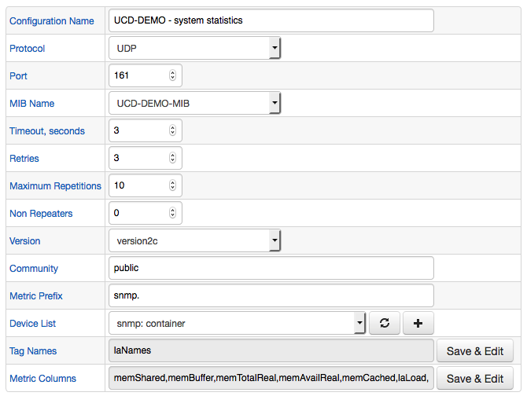

# SNMP Job

The SNMP job collects metrics from IP-addressable devices over the SNMP (Simple Network Management Protocol) protocol. It allows monitoring system availability and performance without installing agents on the target system. The statistics are exposed by a built-in SNMP daemon available on most operating systems including Linux, Windows, HP-UX, and network devices such as routers, switches etc.

## MIB Files

The SNMP daemon running on the remote system publishes available configuration and performance attributes using OIDs (object identifiers).
The OIDs are defined in Management Information Base (MIB) files and contain information such as attribute name, type, data type etc.

```txt
laLoad .1.3.6.1.4.1.2021.10.1.3

enterprises.ucdavis.laTable.laEntry.laLoad
laLoad OBJECT-TYPE
  -- FROM	UCD-SNMP-MIB
  -- TEXTUAL CONVENTION DisplayString
  SYNTAX	OCTET STRING (0..255)
  DISPLAY-HINT	"255a"
  MAX-ACCESS	read-only
  STATUS	current
  DESCRIPTION	"The 1,5 and 15 minute load averages (one per row)."
::= { iso(1) org(3) dod(6) internet(1) private(4) enterprises(1) ucdavis(2021) laTable(10) laEntry(1) 3 }
```

The Collector instance needs access to MIB files to translate OIDs received from the remote systems into attribute names used in ATSD the metric and series tag names.

```txt
1.3.6.1.4.1.2021.10.1.3 --> laLoad
```

```ls
series e:36e26a5fd70a d:2018-06-27T10:09:19.649Z t:laNames=Load-1 m:snmp.laLoad=2.79
```

The SNMP job supports built-in and custom MIB files.


## SNMP MIB Import

Load MIB files into the Collector instance on the **Admin > SNMP MIBs** page.

Perform this task initially, as part of post-installation configuration, as well as when you enable monitoring for a new class of remote systems with custom MIB files.

Open **Admin > SNMP MIBs > Upload MIB** page.

Attach a MIB file and click **Upload**.


The MIB file is validated and translated using the [`snmptranslate`](http://net-snmp.sourceforge.net/tutorial/tutorial-5/commands/snmptranslate.html) utility installed on the underlying Linux operating system. A translated list of OIDs is loaded into the Collector database.

### MIB Tree

MIB format is hierarchical and allows for inheriting definitions from parent MIBs. As a result, you must import parent MIBs first.

```txt
IF-MIB DEFINITIONS ::= BEGIN

IMPORTS
    MODULE-IDENTITY, OBJECT-TYPE, Counter32, Gauge32, Counter64,
    Integer32, TimeTicks, mib-2,
    NOTIFICATION-TYPE                        FROM SNMPv2-SMI
    TEXTUAL-CONVENTION, DisplayString,
    PhysAddress, TruthValue, RowStatus,
    TimeStamp, AutonomousType, TestAndIncr   FROM SNMPv2-TC
    MODULE-COMPLIANCE, OBJECT-GROUP,
    NOTIFICATION-GROUP                       FROM SNMPv2-CONF
    snmpTraps                                FROM SNMPv2-MIB
    IANAifType                               FROM IANAifType-MIB;
```

When you import the MIB file the Collector will search for parent files among the previously loaded MIB files as MIB files stored on the underlying Linux operating system, typically in the `/usr/share/snmp` directory.

### Base MIB Files

The following table contains links to MIB files for monitoring core operating system performance metrics.

* Linux

| MIB  | Description  |
|:---|:---|
| [`UCD-DEMO-MIB`](./resources/UCD-DEMO-MIB.txt) | System load average, CPU utilization, memory configuration and usage, disk used |
| [`IF-MIB`](./resources/UCD-DEMO-MIB.txt) | Network interface counters |

## Job Settings

The SNMP job supports creating multiple configurations for different MIB files, which are executed sequentially.

Each configuration retrieves pre-selected OID values from the **Device List** consisting of hostnames or IP addresses. Metrics sent into ATSD are reported under entity names which is based on the hostname or IP address as specified in the **Device List**.


## Configuration Settings

SNMP job configuration settings.

### Query Settings

| Field          | Description  |
| :------------- |:-------------|
| Device List | List of hostnames or IP addresses to retrieve OIDs from. |
| Metric Prefix | Prefix added to metric names sent into ATSD. |
| MIB Name | MIB file containing the OIDs to query. |
| Metric Columns | Columns containing the metric values. |
| Tag Names | Source of tags. |

### Connection Settings

| Field          | Description  |
| :------------- |:-------------|
| Transport | TCP or UDP protocol used for connecting to the devices. |
| Port | TCP or UDP port. |
| Version | SNMP protocol version. |
| Community |  SNMP community name, such as `public`.|
| Timeout, seconds | Number of seconds after which the Collector interrupts the query.<br>`-1` is unlimited. |
| Retries | Number of connection retries in case of network failure. |
| Maximum Repetitions | Maximum number of iterations over the repeating variables. |
| Non Repeaters | Number of supplied variables that should not be iterated over. |

### Version3c Extended Settings

| Field          | Description  |
| :------------- |:-------------|
| Authentication Protocol | Encryption protocol for authentication.<br >Allowed values: `MD5`, `SHA`. |
| Security Name | Username. |
| Authentication Pass Phrase | Password. |
| Privacy Pass Phrase| Pass phrase for data transmission. |
| Privacy Protocol | Data encryption protocol.<br>Allowed values: `DES`, `TRIPLE_DES`, `AES128`, `AES192`, `AES256`. |
| Security Level | Security level. Allowed values:<br>`NO_AUTH_NO_PRIV`: no authentication, no encryption. <br> `AUTH_NO_PRIV`: authentication, no encryption. <br> `AUTH_PRIV`: authentication and encryption. |

#### Configuration Example

SNMP configuration example:



Click **Test** to view sample series commands for the given configuration.

```ls
series e:36e26a5fd70a d:2018-06-27T11:14:56.481Z m:snmp.memShared=494356
series e:36e26a5fd70a d:2018-06-27T11:14:56.481Z m:snmp.memBuffer=403904
series e:36e26a5fd70a d:2018-06-27T11:14:56.481Z m:snmp.memTotalReal=65124968
series e:36e26a5fd70a d:2018-06-27T11:14:56.481Z m:snmp.memAvailReal=16156972
series e:36e26a5fd70a d:2018-06-27T11:14:56.481Z m:snmp.memCached=25270224
series e:36e26a5fd70a d:2018-06-27T11:14:56.481Z t:laNames=Load-1 m:snmp.laLoad=1.56
series e:36e26a5fd70a d:2018-06-27T11:14:56.481Z t:laNames=Load-15 m:snmp.laLoad=2.14
series e:36e26a5fd70a d:2018-06-27T11:14:56.481Z t:laNames=Load-5 m:snmp.laLoad=1.97
series e:36e26a5fd70a d:2018-06-27T11:14:56.481Z m:snmp.memTotalFree=49637572
series e:36e26a5fd70a d:2018-06-27T11:14:56.481Z m:snmp.memAvailSwap=33480600
series e:36e26a5fd70a d:2018-06-27T11:14:56.481Z m:snmp.memTotalSwap=33537916
```